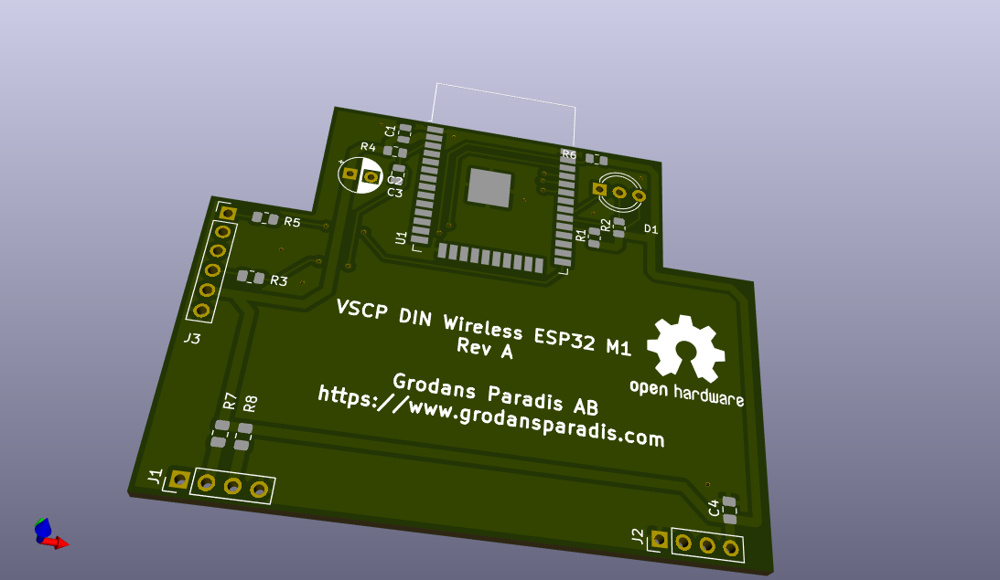
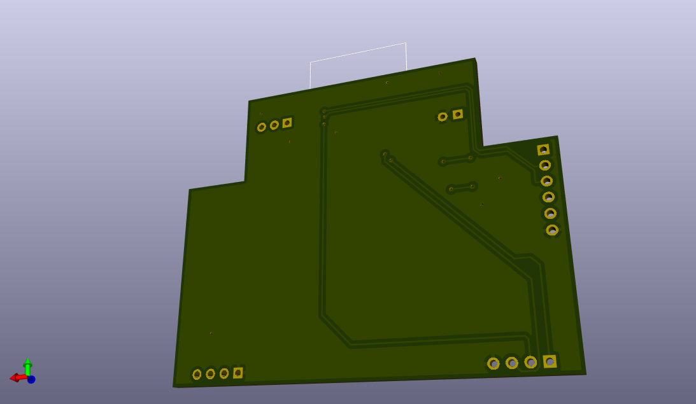

# vscp-din-wireless-esp32
ESP32 based wifi/bt VSCP controller in a single module DIN package

**Note!** This is still a prototype.

## PCB's

 

---

Part of the [VSCP Project](https://www.vscp.org).

Copyright 2021-2022 © Åke Hedman, (Grodans Paradis AB)[https://www.grodansparadis.com]